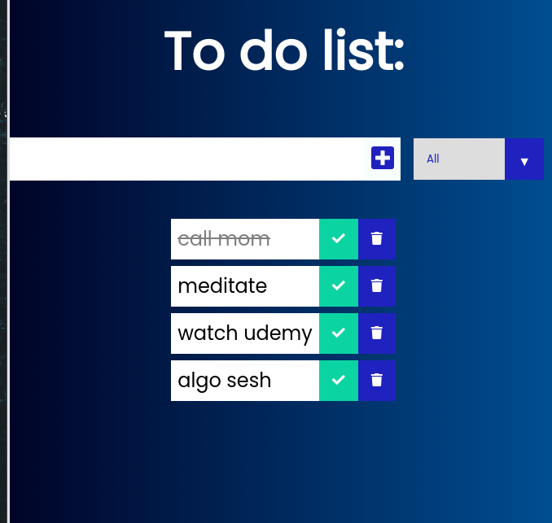

## React To Do list
React hooks were used: useState, useEffect. Browser local storage stores items.

## Install
must have node v.12+
run `npm i`

## Start
`npm start`
open http://localhost:3000/

## Screenshot
